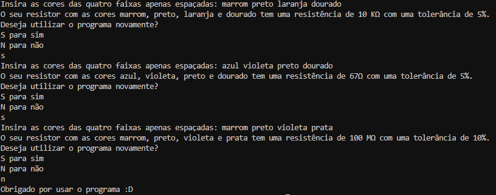

# Calculadora de Resistência (4 Cores)
Um programa para determinação rápida de resistência elétrica para 4 faixas.
## Descrição
O seguinte programa, desenvolvido em python, recebe as cores de faixas do resistor, determina a sua resistência automaticamente e informa para o usuário. O programa foi pensado para resistores com 4 faixas de cores, então use-o para tal resistor.
## Público-Alvo
Esse programa pode servir para estudantes de Eletrotécnica ou Engenharia Elétrica, para amantes de robôtica e eletrônica e até para profissionais da área.
## Exemplo
O programa recebe 4 cores e retorna a resistência e tolerância, por exemplo. Caso o usuário entre com as cores "marrom preto laranja dourado" o programa irá retornar uma resistência de 10k com tolerância de 5%. Segue uma imagem com alguns exemplos do programa em funcionamento:  

## Execução
### Pré-Requisitos
- Python 3 instalado  
Para obter o Python 3, basta acessar o site oficial do Python (https://www.python.org/) e buscar instalar a versão mais recente do programa.
### Utilização
Para utilizar o programa, basta executar e seguir as instruções, que é escrever as 4 cores com apenas espaços entre elas. Conforme for utilizando, você informa se deseja continuar usando ou encerrar. Ao encerrar, o programa terá que ser executado novamente para funcionar.